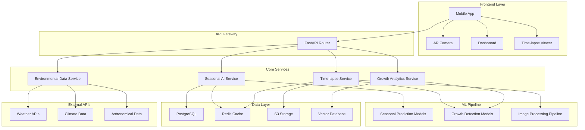
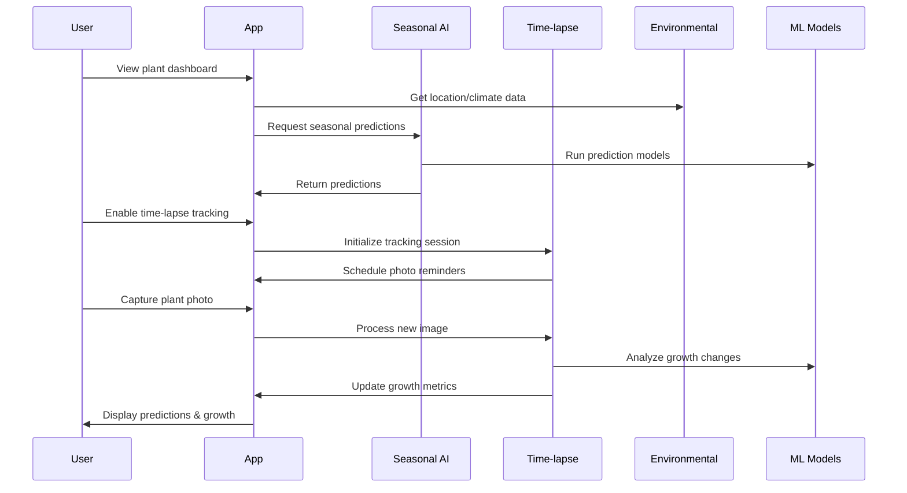

# Design Document

## Overview

The Seasonal AI and Time-lapse Growth Tracking enhancement introduces predictive intelligence and automated visual documentation to the Plant Social platform. This system combines machine learning models for seasonal behavior prediction with computer vision for automated growth tracking, creating a comprehensive plant care intelligence system.

The design leverages existing ML infrastructure while adding new specialized models for seasonal prediction and image analysis for growth tracking. The system integrates seamlessly with current features while providing new capabilities for proactive plant care and community engagement.

## Architecture

### High-Level System Architecture



### Data Flow Architecture



## Components and Interfaces

### 1. Seasonal AI Service

**Purpose**: Provides predictive insights about plant behavior based on seasonal patterns, environmental data, and plant species characteristics.

**Key Methods**:
```python
class SeasonalAIService:
    async def predict_seasonal_behavior(
        self, 
        plant_id: str, 
        prediction_days: int = 90
    ) -> SeasonalPrediction
    
    async def get_seasonal_care_adjustments(
        self, 
        plant_id: str, 
        current_season: Season
    ) -> List[CareAdjustment]
    
    async def detect_seasonal_transitions(
        self, 
        location: Location
    ) -> List[SeasonalTransition]
    
    async def predict_growth_phases(
        self, 
        plant_species: str, 
        environmental_conditions: EnvironmentalData
    ) -> List[GrowthPhase]
```

**Data Models**:
```python
@dataclass
class SeasonalPrediction:
    plant_id: str
    prediction_period: DateRange
    growth_forecast: GrowthForecast
    care_adjustments: List[CareAdjustment]
    risk_factors: List[RiskFactor]
    optimal_activities: List[PlantActivity]
    confidence_score: float

@dataclass
class GrowthForecast:
    expected_growth_rate: float
    size_projections: List[SizeProjection]
    flowering_predictions: List[FloweringPeriod]
    dormancy_periods: List[DormancyPeriod]
    stress_likelihood: float
```

### 2. Time-lapse Growth Tracking Service

**Purpose**: Manages automated photo capture, growth analysis, and time-lapse video generation.

**Key Methods**:
```python
class TimelapseService:
    async def initialize_tracking(
        self, 
        plant_id: str, 
        tracking_config: TrackingConfig
    ) -> TrackingSession
    
    async def process_growth_photo(
        self, 
        session_id: str, 
        image: UploadFile
    ) -> GrowthAnalysis
    
    async def generate_timelapse_video(
        self, 
        session_id: str, 
        options: VideoOptions
    ) -> TimelapseVideo
    
    async def detect_growth_milestones(
        self, 
        session_id: str
    ) -> List[GrowthMilestone]
    
    async def analyze_growth_patterns(
        self, 
        plant_id: str, 
        time_range: DateRange
    ) -> GrowthAnalytics
```

**Data Models**:
```python
@dataclass
class TrackingSession:
    session_id: str
    plant_id: str
    start_date: datetime
    photo_schedule: PhotoSchedule
    current_metrics: GrowthMetrics
    milestone_targets: List[MilestoneTarget]

@dataclass
class GrowthAnalysis:
    photo_id: str
    capture_date: datetime
    plant_measurements: PlantMeasurements
    health_indicators: HealthIndicators
    growth_changes: GrowthChanges
    anomaly_flags: List[AnomalyFlag]
```

### 3. Environmental Data Service

**Purpose**: Integrates external environmental data sources to provide context for seasonal predictions.

**Key Methods**:
```python
class EnvironmentalDataService:
    async def get_seasonal_climate_data(
        self, 
        location: Location, 
        date_range: DateRange
    ) -> ClimateData
    
    async def get_daylight_patterns(
        self, 
        location: Location, 
        year: int
    ) -> DaylightPatterns
    
    async def predict_weather_trends(
        self, 
        location: Location, 
        days_ahead: int
    ) -> WeatherForecast
    
    async def get_seasonal_pest_data(
        self, 
        location: Location, 
        plant_species: str
    ) -> PestRiskData
```

### 4. AR Seasonal Visualization Component

**Purpose**: Provides augmented reality overlays for seasonal predictions and growth projections.

**Key Features**:
- Real-time seasonal prediction overlays
- Growth projection visualizations
- Interactive seasonal care tips
- Time-lapse preview in AR space

**Interface**:
```dart
class ARSeasonalOverlay extends StatefulWidget {
  final Plant plant;
  final SeasonalPrediction predictions;
  final TimelapseSession? timelapseSession;
  
  @override
  Widget build(BuildContext context) {
    return ARView(
      overlays: [
        SeasonalPredictionOverlay(predictions),
        GrowthProjectionOverlay(plant, predictions),
        CareRecommendationOverlay(predictions.careAdjustments),
        TimelapsePreviewOverlay(timelapseSession),
      ],
    );
  }
}
```

## Data Models

### Database Schema Extensions

**Seasonal Predictions Table**:
```sql
CREATE TABLE seasonal_predictions (
    id UUID PRIMARY KEY,
    plant_id UUID REFERENCES user_plants(id),
    prediction_date TIMESTAMP,
    prediction_period_start DATE,
    prediction_period_end DATE,
    growth_forecast JSONB,
    care_adjustments JSONB,
    risk_factors JSONB,
    confidence_score FLOAT,
    created_at TIMESTAMP DEFAULT NOW()
);
```

**Time-lapse Sessions Table**:
```sql
CREATE TABLE timelapse_sessions (
    id UUID PRIMARY KEY,
    plant_id UUID REFERENCES user_plants(id),
    user_id UUID REFERENCES users(id),
    session_name VARCHAR(255),
    start_date TIMESTAMP,
    end_date TIMESTAMP,
    photo_schedule JSONB,
    tracking_config JSONB,
    status VARCHAR(50),
    created_at TIMESTAMP DEFAULT NOW()
);
```

**Growth Photos Table**:
```sql
CREATE TABLE growth_photos (
    id UUID PRIMARY KEY,
    session_id UUID REFERENCES timelapse_sessions(id),
    photo_url VARCHAR(500),
    capture_date TIMESTAMP,
    plant_measurements JSONB,
    growth_analysis JSONB,
    processing_status VARCHAR(50),
    created_at TIMESTAMP DEFAULT NOW()
);
```

**Environmental Data Cache Table**:
```sql
CREATE TABLE environmental_data_cache (
    id UUID PRIMARY KEY,
    location_hash VARCHAR(100),
    data_type VARCHAR(50),
    date_range DATERANGE,
    data JSONB,
    expires_at TIMESTAMP,
    created_at TIMESTAMP DEFAULT NOW()
);
```

## Error Handling

### Graceful Degradation Strategy

1. **Seasonal AI Failures**:
   - Fall back to rule-based seasonal recommendations
   - Use cached predictions from similar plants/locations
   - Provide generic seasonal care tips

2. **Time-lapse Processing Failures**:
   - Retry image processing with different parameters
   - Generate partial time-lapse with available photos
   - Maintain photo archive for manual processing

3. **Environmental Data Unavailable**:
   - Use historical averages for location
   - Fall back to user-provided environmental data
   - Provide general seasonal guidance

4. **AR Rendering Issues**:
   - Fall back to 2D overlay display
   - Provide text-based prediction summaries
   - Cache AR content for offline viewing

### Error Recovery Mechanisms

```python
class SeasonalAIErrorHandler:
    async def handle_prediction_failure(
        self, 
        plant_id: str, 
        error: Exception
    ) -> SeasonalPrediction:
        try:
            # Try cached predictions
            cached = await self.get_cached_prediction(plant_id)
            if cached and not self.is_stale(cached):
                return cached
            
            # Fall back to rule-based system
            return await self.generate_rule_based_prediction(plant_id)
        except Exception as fallback_error:
            # Return minimal safe prediction
            return self.get_minimal_prediction(plant_id)
```

## Testing Strategy

### Unit Testing

1. **Seasonal AI Models**:
   - Test prediction accuracy with historical data
   - Validate edge cases (extreme weather, rare species)
   - Test model performance with limited data

2. **Time-lapse Processing**:
   - Test image analysis accuracy
   - Validate growth measurement algorithms
   - Test video generation with various photo sets

3. **Environmental Data Integration**:
   - Test API integration reliability
   - Validate data transformation accuracy
   - Test caching and fallback mechanisms

### Integration Testing

1. **End-to-End Workflows**:
   - Complete seasonal prediction pipeline
   - Full time-lapse creation process
   - AR overlay rendering and interaction

2. **Performance Testing**:
   - ML model inference speed
   - Image processing throughput
   - Database query optimization

### User Acceptance Testing

1. **Prediction Accuracy**:
   - Compare AI predictions with actual plant behavior
   - Validate user satisfaction with recommendations
   - Test seasonal transition detection accuracy

2. **Time-lapse Quality**:
   - Evaluate video generation quality
   - Test growth milestone detection accuracy
   - Validate user engagement with time-lapse content

## Performance Considerations

### Optimization Strategies

1. **ML Model Optimization**:
   - Use model quantization for mobile deployment
   - Implement model caching for frequent predictions
   - Batch processing for multiple plant predictions

2. **Image Processing Optimization**:
   - Implement progressive image analysis
   - Use background processing for time-lapse generation
   - Optimize storage with image compression

3. **Data Caching Strategy**:
   - Cache environmental data by location and date
   - Store frequently accessed predictions in Redis
   - Implement intelligent cache invalidation

4. **AR Performance**:
   - Optimize 3D rendering for mobile devices
   - Implement level-of-detail for complex overlays
   - Use efficient texture streaming for AR content

### Scalability Considerations

1. **Horizontal Scaling**:
   - Distribute ML inference across multiple workers
   - Implement queue-based image processing
   - Use CDN for time-lapse video delivery

2. **Database Optimization**:
   - Partition large tables by date ranges
   - Implement read replicas for analytics queries
   - Use appropriate indexing strategies

3. **Resource Management**:
   - Implement rate limiting for expensive operations
   - Use background jobs for non-critical processing
   - Monitor and alert on resource usage patterns