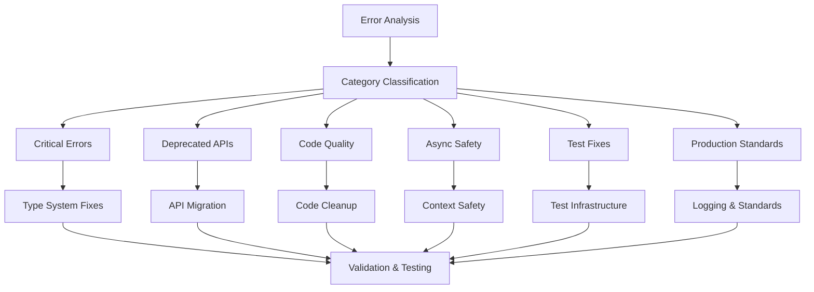

# Design Document

## Overview

This design document outlines the systematic approach to resolving 636 Flutter analyze issues in the LeafWise mobile application. The solution employs a modular, category-based approach that addresses critical errors, deprecated APIs, code quality issues, async safety, test corrections, and production standards while maintaining the existing architecture and functionality.

## Steering Document Alignment

### Technical Standards (tech.md)
The design follows Flutter best practices and maintains consistency with the existing codebase patterns:
- Riverpod for state management
- Feature-based modular architecture
- Freezed for immutable data classes
- Retrofit for API services
- Clean architecture separation of concerns

### Project Structure (structure.md)
The implementation preserves the established project organization:
- `lib/features/` - Feature-based modules
- `lib/core/` - Shared utilities and services
- `test/` - Comprehensive test coverage
- Maintains existing import patterns and naming conventions

## Code Reuse Analysis

### Existing Components to Leverage
- **Error Handling Patterns**: Extend existing `ApiException` and error widgets for consistent error management
- **Logging Infrastructure**: Build upon existing debug patterns to replace print statements
- **Provider Architecture**: Utilize established Riverpod patterns for state management fixes
- **Widget Abstractions**: Leverage existing `LoadingWidget` and `ErrorWidget` for UI consistency

### Integration Points
- **Build System**: Integrate with existing `build_runner` configuration for code generation
- **Analysis Configuration**: Extend current `analysis_options.yaml` with additional rules
- **Test Framework**: Build upon existing test infrastructure with proper mocking and provider setup
- **CI/CD Pipeline**: Ensure fixes don't break existing automated testing and deployment

## Architecture

The fix implementation follows a layered approach that maintains the existing clean architecture while systematically addressing each category of issues:

### Modular Design Principles
- **Single File Responsibility**: Each fix targets specific error types without cross-contamination
- **Component Isolation**: Maintain existing feature boundaries and component separation
- **Service Layer Separation**: Preserve data access, business logic, and presentation layer distinctions
- **Utility Modularity**: Enhance existing utilities without breaking existing functionality



## Components and Interfaces

### Error Resolution Engine
- **Purpose:** Systematically categorize and resolve Flutter analyze issues
- **Interfaces:** Category-specific fix methods, validation utilities
- **Dependencies:** Flutter SDK, existing codebase patterns
- **Reuses:** Existing error handling, logging, and testing infrastructure

### Type System Harmonizer
- **Purpose:** Resolve type mismatches and static access errors
- **Interfaces:** Type alignment methods, instance access converters
- **Dependencies:** Dart type system, existing model definitions
- **Reuses:** Existing Freezed models and JSON serialization patterns

### API Migration Service
- **Purpose:** Update deprecated Flutter APIs to modern alternatives
- **Interfaces:** API replacement methods, compatibility validators
- **Dependencies:** Flutter framework versions, existing UI components
- **Reuses:** Existing theme system and widget abstractions

### Code Quality Optimizer
- **Purpose:** Remove unused code and improve maintainability
- **Interfaces:** Dead code detection, import optimization
- **Dependencies:** Static analysis tools, existing codebase structure
- **Reuses:** Existing modular architecture and naming conventions

### Async Safety Guardian
- **Purpose:** Ensure BuildContext safety across async operations
- **Interfaces:** Context validation, lifecycle management
- **Dependencies:** Flutter widget lifecycle, existing async patterns
- **Reuses:** Existing provider patterns and state management

### Test Infrastructure Enhancer
- **Purpose:** Fix test compilation and execution issues
- **Interfaces:** Test setup utilities, mock providers
- **Dependencies:** Flutter test framework, Riverpod testing utilities
- **Reuses:** Existing test patterns and mock implementations

## Data Models

### Error Classification Model
```dart
class AnalyzeError {
  final String filePath;
  final int lineNumber;
  final String errorCode;
  final ErrorSeverity severity;
  final ErrorCategory category;
  final String description;
  final String suggestedFix;
}

enum ErrorSeverity { error, warning, info }
enum ErrorCategory { 
  criticalError, 
  deprecatedApi, 
  codeQuality, 
  asyncSafety, 
  testIssue, 
  productionStandard 
}
```

### Fix Result Model
```dart
class FixResult {
  final String filePath;
  final bool success;
  final List<String> appliedFixes;
  final List<String> remainingIssues;
  final Map<String, dynamic> metadata;
}
```

## Error Handling

### Error Scenarios
1. **Fix Application Failure:** When automated fixes cannot be applied
   - **Handling:** Log detailed error information, provide manual fix suggestions
   - **User Impact:** Clear documentation of required manual intervention

2. **Regression Introduction:** When fixes break existing functionality
   - **Handling:** Rollback mechanism, comprehensive testing validation
   - **User Impact:** Maintain application stability and functionality

3. **Build System Conflicts:** When fixes conflict with code generation
   - **Handling:** Coordinate with build_runner, resolve generation conflicts
   - **User Impact:** Ensure successful compilation and code generation

4. **Test Suite Failures:** When fixes break existing tests
   - **Handling:** Update test expectations, maintain test coverage
   - **User Impact:** Preserve test reliability and development workflow

## Testing Strategy

### Unit Testing
- Validate each fix category independently
- Test error classification accuracy
- Verify fix application without side effects
- Ensure type system corrections maintain functionality

### Integration Testing
- Test fix combinations across multiple files
- Validate build system integration
- Ensure provider and state management fixes work together
- Test API migration compatibility

### End-to-End Testing
- Run complete Flutter analyze after all fixes
- Validate application compilation and execution
- Test user-facing functionality remains intact
- Verify performance impact is minimal

### Regression Testing
- Compare before/after application behavior
- Validate existing test suite continues to pass
- Ensure no new analyze issues are introduced
- Test across different Flutter SDK versions

### Validation Criteria
- Zero critical errors remaining
- All deprecated APIs updated to modern alternatives
- Unused code elements removed or documented
- BuildContext usage made async-safe
- Test files compile and execute successfully
- Production code follows Flutter best practices
- Application functionality preserved
- Performance maintained or improved