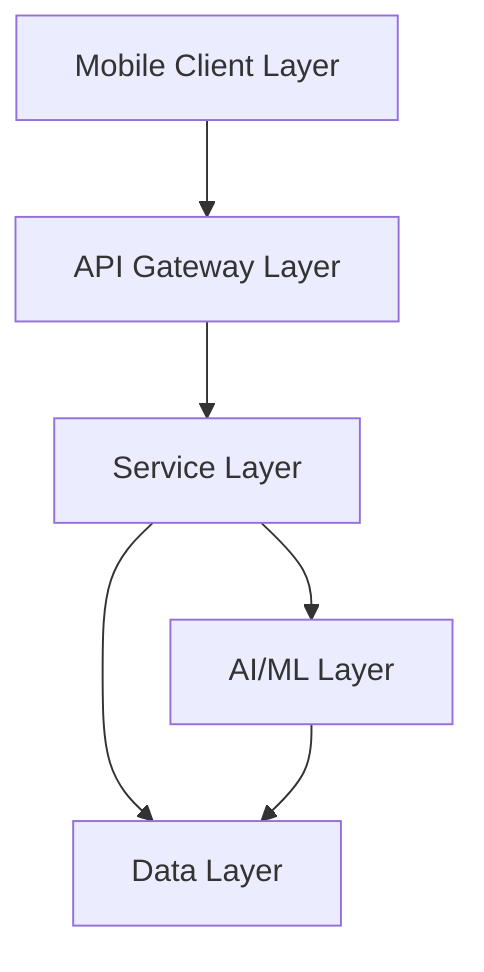

# Design Document

## Overview

The Phase 1 Foundation establishes the core infrastructure and essential features for the LeafWise application. This design document outlines the technical approach for implementing the project structure, camera integration, AI plant identification, user authentication, user profiles, and plant collection functionality as specified in the requirements document.

## Steering Document Alignment

### Technical Standards (tech.md)

This design follows the technical standards outlined in the tech.md document by:
- Using React Native 0.79+ with New Architecture for the mobile application
- Implementing Redux Toolkit with RTK Query for state management
- Following the modular, service-oriented architecture with clear separation of concerns
- Utilizing Firebase Auth for authentication services
- Leveraging third-party API for plant identification in the initial phase
- Implementing PostgreSQL for relational data storage

### Project Structure (structure.md)

The implementation will adhere to the project organization conventions defined in structure.md by:
- Following the prescribed directory structure for the root level organization
- Organizing source code into app, features, core, services, and ui directories
- Structuring feature modules consistently with api, components, hooks, screens, types, and utils subdirectories
- Using the defined naming conventions for files, directories, and code elements

## Code Reuse Analysis

As this is the initial phase of development, there is no existing code to leverage. However, we will establish patterns and components designed for reuse in subsequent phases.

### Existing Components to Leverage
- **Third-party Plant Identification API**: Will be integrated for plant recognition functionality
- **Firebase Auth**: Will be utilized for user authentication and management
- **React Native Camera**: Will be leveraged for camera integration

### Integration Points
- **Firebase Authentication**: User authentication and profile management
- **Plant Identification API**: External service for plant recognition
- **PostgreSQL Database**: Storage for user profiles and plant collections
- **Cloud Storage**: For storing plant images and user profile pictures

## Architecture

The LeafWise application will follow a modular, feature-based architecture with clear separation of concerns. The architecture emphasizes maintainability, scalability, and adherence to AI-first development principles.

### Modular Design Principles
- **Single File Responsibility**: Each file will handle one specific concern or domain
- **Component Isolation**: We will create small, focused components rather than large monolithic files
- **Service Layer Separation**: Data access, business logic, and presentation layers will be clearly separated
- **Utility Modularity**: Utilities will be broken into focused, single-purpose modules



## Components and Interfaces

### Camera Module
- **Purpose:** Provide camera interface optimized for plant photography
- **Interfaces:** 
  - `openCamera(): Promise<void>`
  - `takePicture(): Promise<ImageResult>`
  - `processPicture(image: ImageResult): Promise<ProcessedImage>`
- **Dependencies:** React Native Camera, Image Processing Utilities
- **Reuses:** React Native Camera library

### Plant Identification Module
- **Purpose:** Process plant images and return identification results
- **Interfaces:** 
  - `identifyPlant(image: ProcessedImage): Promise<IdentificationResult[]>`
  - `getPlantDetails(plantId: string): Promise<PlantDetails>`
- **Dependencies:** API Service, Image Processing Utilities
- **Reuses:** Third-party Plant Identification API

### Authentication Module
- **Purpose:** Manage user authentication and session state
- **Interfaces:** 
  - `register(email: string, password: string): Promise<User>`
  - `login(email: string, password: string): Promise<User>`
  - `resetPassword(email: string): Promise<void>`
  - `logout(): Promise<void>`
- **Dependencies:** Firebase Auth, Storage Service
- **Reuses:** Firebase Authentication

### User Profile Module
- **Purpose:** Manage user profile information and preferences
- **Interfaces:** 
  - `getProfile(userId: string): Promise<UserProfile>`
  - `updateProfile(profile: UserProfile): Promise<UserProfile>`
  - `deleteAccount(userId: string): Promise<void>`
- **Dependencies:** Authentication Module, Storage Service, API Service
- **Reuses:** Firebase Auth User Management

### Plant Collection Module
- **Purpose:** Manage user's saved plants and collections
- **Interfaces:** 
  - `savePlant(plant: Plant): Promise<Plant>`
  - `getCollection(userId: string): Promise<Plant[]>`
  - `getPlant(plantId: string): Promise<Plant>`
  - `searchCollection(query: string): Promise<Plant[]>`
- **Dependencies:** User Profile Module, Plant Identification Module, Storage Service
- **Reuses:** None (new implementation)

## Data Models

### User
```
User {
  id: string (UUID)
  email: string
  createdAt: timestamp
  lastLogin: timestamp
  isVerified: boolean
}
```

### UserProfile
```
UserProfile {
  userId: string (UUID, foreign key to User)
  displayName: string
  bio: string (optional)
  profilePicture: string (URL, optional)
  location: string (optional)
  preferences: JSON
  statistics: {
    plantsIdentified: number
    plantsSaved: number
  }
}
```

### Plant
```
Plant {
  id: string (UUID)
  userId: string (UUID, foreign key to User)
  scientificName: string
  commonName: string
  family: string
  imageUrl: string
  identifiedAt: timestamp
  location: {
    latitude: number (optional)
    longitude: number (optional)
  }
  confidence: number (0-100)
  basicInfo: string
  careInfo: JSON (optional)
}
```

## Error Handling

### Error Scenarios
1. **Camera Permission Denied**
   - **Handling:** Display explanation of why permission is needed with option to retry
   - **User Impact:** Clear message explaining that camera access is required for plant identification

2. **Plant Identification Failure**
   - **Handling:** Retry with different API parameters, provide feedback on image quality
   - **User Impact:** Suggestions for taking better photos (lighting, angle, focus)

3. **Authentication Failure**
   - **Handling:** Validate input, provide specific error messages, offer password reset
   - **User Impact:** Clear indication of what went wrong (invalid credentials, account not found)

4. **Network Connectivity Issues**
   - **Handling:** Implement offline mode for viewing saved plants, queue operations for sync
   - **User Impact:** Notification of offline status with explanation of limited functionality

5. **API Rate Limiting**
   - **Handling:** Implement exponential backoff, cache common results
   - **User Impact:** Transparent messaging about temporary limitations

## Testing Strategy

### Unit Testing
- Test individual components and services in isolation
- Mock external dependencies (API, camera, storage)
- Focus on business logic and utility functions
- Aim for 80%+ coverage of core functionality

### Integration Testing
- Test interactions between modules (e.g., authentication → profile)
- Verify API integration with mock servers
- Test data flow through the application
- Validate error handling across module boundaries

### End-to-End Testing
- Test critical user flows (registration, login, plant identification, saving to collection)
- Verify camera integration on actual devices
- Test offline functionality and synchronization
- Validate performance on target devices