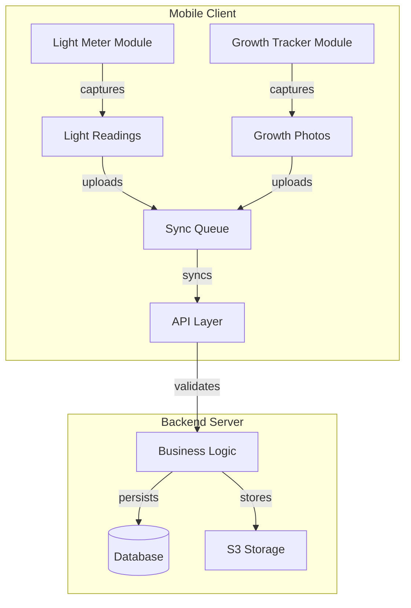

# Sensor & Photo Telemetry - Design Document

## Overview

This document outlines the technical design for the Sensor & Photo Telemetry feature, which enables users to measure light intensity and track plant growth through photos. The design follows clean architecture principles with clear separation of concerns and focuses on reliability, performance, and usability.

## Architecture

### System Components



### Data Flow

1. User captures light readings using one of three methods (ALS, Camera, BLE)
2. Readings are stored locally and queued for synchronization
3. User takes growth photos which are processed for metrics
4. Photos are stored locally and queued for upload
5. When online, data is synchronized with the backend
6. Backend validates, processes, and stores the data
7. Data is made available for retrieval and analysis

## Database Design

### Light Readings Table

```sql
CREATE TABLE light_readings (
  id UUID PRIMARY KEY DEFAULT gen_random_uuid(),
  user_id UUID NOT NULL,
  plant_id UUID,
  location_tag TEXT,
  source TEXT CHECK (source IN ('ALS','CAMERA','BLE')),
  lux REAL NOT NULL,
  ppfd_est REAL,
  light_source_profile TEXT CHECK (light_source_profile IN ('sun','white_led','other')),
  device_model TEXT,
  calibration_profile_id TEXT,
  taken_at TIMESTAMPTZ NOT NULL,
  created_at TIMESTAMPTZ DEFAULT now()
);

CREATE INDEX idx_light_readings_plant_id ON light_readings(plant_id);
CREATE INDEX idx_light_readings_user_id ON light_readings(user_id);
CREATE INDEX idx_light_readings_taken_at ON light_readings(taken_at);
```

### Growth Photos Table

```sql
CREATE TABLE growth_photos (
  id UUID PRIMARY KEY DEFAULT gen_random_uuid(),
  user_id UUID NOT NULL,
  plant_id UUID NOT NULL,
  s3_uri TEXT NOT NULL,
  width INT, 
  height INT,
  taken_at TIMESTAMPTZ NOT NULL,
  metrics JSONB, -- e.g., {"leaf_area_px": 18234, "height_px": 812}
  created_at TIMESTAMPTZ DEFAULT now()
);

CREATE INDEX idx_growth_photos_plant_id ON growth_photos(plant_id);
CREATE INDEX idx_growth_photos_user_id ON growth_photos(user_id);
CREATE INDEX idx_growth_photos_taken_at ON growth_photos(taken_at);
```

## API Design

### Light Readings API

#### POST /api/v1/telemetry/light

Submits a single light reading.

**Request Body:**
```json
{
  "plant_id": "uuid-string",
  "location_tag": "South window",
  "source": "CAMERA",
  "lux": 5800,
  "ppfd_est": 105,
  "light_source_profile": "sun",
  "device_model": "iPhone15,4",
  "calibration_profile_id": "cal_v1",
  "taken_at": "2025-09-05T18:58:00Z"
}
```

**Response:** `201 Created` with the created resource ID

#### POST /api/v1/telemetry/light:batch

Submits multiple light readings in a batch.

**Request Body:**
```json
{
  "readings": [
    {
      "plant_id": "uuid-string",
      "location_tag": "South window",
      "source": "CAMERA",
      "lux": 5800,
      "ppfd_est": 105,
      "light_source_profile": "sun",
      "device_model": "iPhone15,4",
      "calibration_profile_id": "cal_v1",
      "taken_at": "2025-09-05T18:58:00Z"
    },
    // Additional readings...
  ]
}
```

**Response:** `207 Multi-Status` with status for each reading

#### GET /api/v1/telemetry/light

Retrieves light readings with optional filtering.

**Query Parameters:**
- `plant_id`: UUID of the plant (optional)
- `location_tag`: Location tag (optional)
- `from`: Start timestamp (optional)
- `to`: End timestamp (optional)
- `limit`: Maximum number of results (default: 100)
- `offset`: Pagination offset (default: 0)

**Response:** `200 OK` with array of light readings

### Growth Photos API

#### POST /api/v1/telemetry/growth-photo:upload

Requests a pre-signed URL for photo upload.

**Request Body:**
```json
{
  "plant_id": "uuid-string",
  "content_type": "image/jpeg",
  "width": 1080,
  "height": 1920,
  "taken_at": "2025-09-05T18:58:00Z"
}
```

**Response:** `200 OK` with pre-signed URL and upload instructions

#### POST /api/v1/telemetry/growth-photo:complete

Notifies that a photo upload is complete and triggers processing.

**Request Body:**
```json
{
  "upload_id": "uuid-string",
  "plant_id": "uuid-string"
}
```

**Response:** `202 Accepted`

#### GET /api/v1/telemetry/growth-photo

Retrieves growth photos with optional filtering.

**Query Parameters:**
- `plant_id`: UUID of the plant (required)
- `from`: Start timestamp (optional)
- `to`: End timestamp (optional)
- `limit`: Maximum number of results (default: 20)
- `offset`: Pagination offset (default: 0)

**Response:** `200 OK` with array of growth photos and metrics

## Client Module Design

### Light Meter Module

```typescript
interface LightReading {
  plant_id?: string;
  location_tag?: string;
  source: 'ALS' | 'CAMERA' | 'BLE';
  lux: number;
  ppfd_est?: number;
  light_source_profile: 'sun' | 'white_led' | 'other';
  device_model: string;
  calibration_profile_id?: string;
  taken_at: string;
}

interface LightMeterStrategy {
  measure(): Promise<number>; // Returns lux value
  isAvailable(): boolean;
  getCalibrationFactor(): number;
}

class LightMeter {
  // Factory method to get appropriate strategy
  static getStrategy(type: 'ALS' | 'CAMERA' | 'BLE'): LightMeterStrategy;
  
  // Measure light with selected strategy
  async measure(strategy: LightMeterStrategy, context: {
    plant_id?: string;
    location_tag?: string;
    light_source_profile: 'sun' | 'white_led' | 'other';
  }): Promise<LightReading>;
  
  // Convert lux to PPFD estimate
  convertLuxToPPFD(lux: number, profile: 'sun' | 'white_led' | 'other'): number;
  
  // Calibration methods
  runCalibrationWizard(): Promise<string>; // Returns calibration_profile_id
  getCalibrationProfiles(): Array<{id: string, name: string, factor: number}>;
}
```

### Growth Tracker Module

```typescript
interface GrowthPhoto {
  plant_id: string;
  local_uri: string;
  width?: number;
  height?: number;
  taken_at: string;
  metrics?: {
    leaf_area_px?: number;
    height_px?: number;
    [key: string]: number;
  };
  upload_status: 'pending' | 'uploading' | 'completed' | 'failed';
}

class GrowthTracker {
  // Capture a new growth photo
  async capturePhoto(plant_id: string): Promise<GrowthPhoto>;
  
  // Process photo to extract metrics
  async processPhoto(photo: GrowthPhoto): Promise<GrowthPhoto>;
  
  // Queue photo for upload
  queueForUpload(photo: GrowthPhoto): void;
  
  // Get upload queue status
  getUploadQueue(): Array<GrowthPhoto>;
  
  // Flush upload queue (attempt to upload all pending photos)
  async flushUploadQueue(): Promise<{success: number, failed: number}>;
}
```

## Error Handling

### Error Types

1. **ValidationError**: Invalid input data
2. **AuthenticationError**: User not authenticated
3. **AuthorizationError**: User not authorized
4. **ResourceNotFoundError**: Requested resource not found
5. **DeviceError**: Hardware/sensor error
6. **NetworkError**: Communication error
7. **StorageError**: Data storage error

### Error Response Format

All errors follow RFC7807 problem+json format:

```json
{
  "type": "https://api.leafwise.app/errors/validation",
  "title": "Validation Error",
  "detail": "The 'lux' value must be a positive number",
  "instance": "/api/v1/telemetry/light/request-123",
  "code": "INVALID_LUX_VALUE"
}
```

### Retry Strategy

For network operations:
1. Initial retry after 1 second
2. Exponential backoff with jitter (max 5 retries)
3. Circuit breaker pattern for persistent failures

## Testing Strategy

### Unit Tests

- Test each module in isolation with mocked dependencies
- Verify light conversion algorithms
- Test error handling and edge cases

### Integration Tests

- Test API endpoints with mock database
- Verify data flow between components
- Test synchronization mechanisms

### End-to-End Tests

- Test complete workflows from data capture to retrieval
- Verify offline functionality and synchronization
- Test with various device types and sensors

### Performance Tests

- Measure API response times under load
- Test batch processing capabilities
- Verify storage and retrieval efficiency

## Implementation Plan

1. Set up database schema and migrations
2. Implement backend API endpoints
3. Develop client-side modules
4. Implement synchronization mechanisms
5. Add metrics and monitoring
6. Conduct testing and performance optimization
7. Deploy with feature flag control